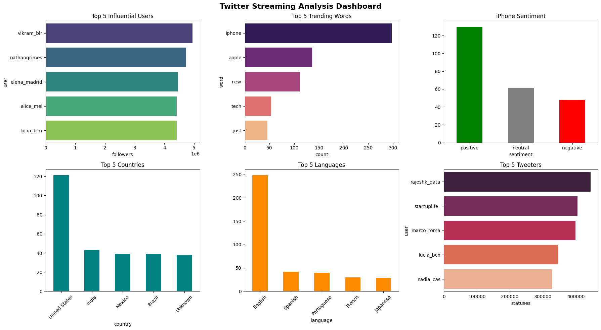
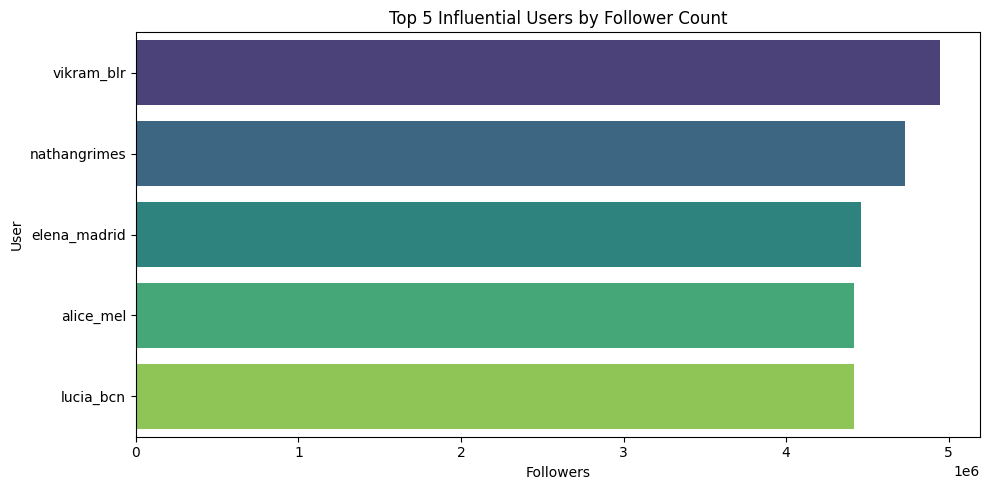
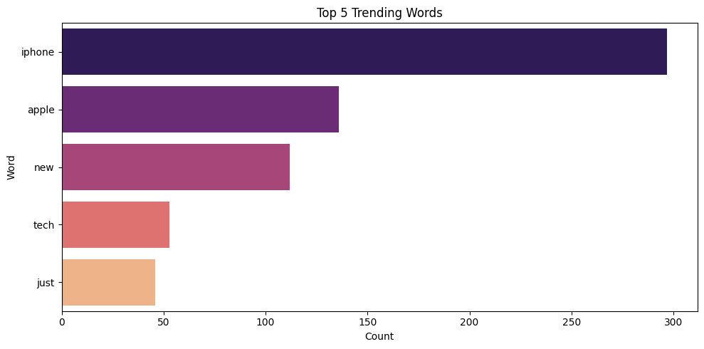
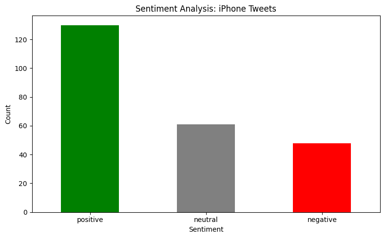
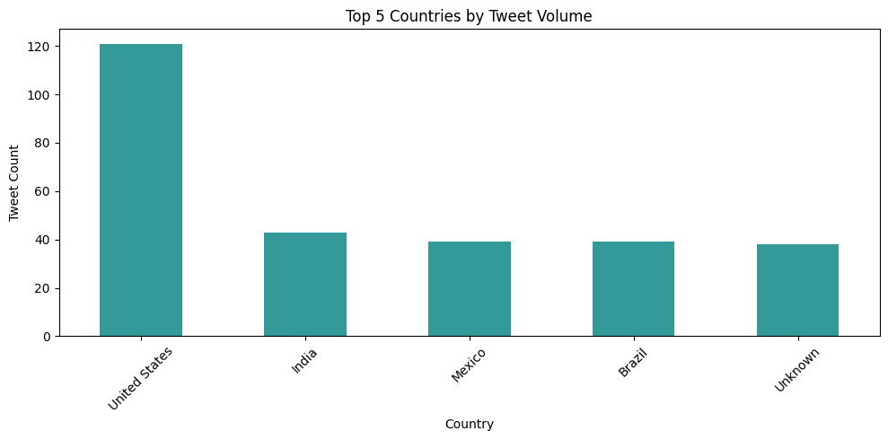
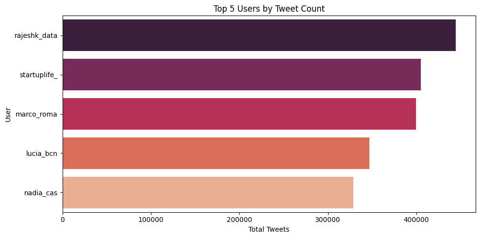
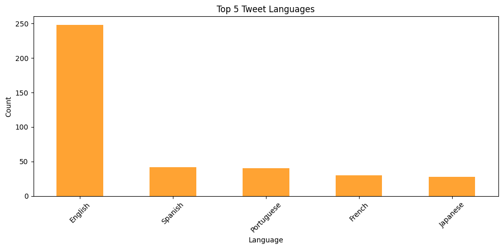

# Real-Time Twitter Sentiment Analysis (Spark Streaming)

_Graded practical — Johns Hopkins Big Data Analytics certificate._

**One line:** A PySpark Streaming pipeline that ingests live tweets and runs six real-time analyses — influential users, trending topics, sentiment, geography, top posters, and language — rolled up into a summary dashboard.

📊 Full rendered notebook with every output: [`outputs/twitter_sentiment_full_report.html`](outputs/twitter_sentiment_full_report.html)

## Objective
Turn a live Twitter stream into real-time, decision-useful signal: who is driving conversation, what is trending, how people feel about a target topic, and where and in what language they are posting.

## Approach
Built on Spark Streaming:
1. Create a Spark Streaming context.
2. Ingest Twitter data into the stream.
3. Helper functions for parsing and cleaning tweets.
4. Process the stream in batch mode, then run six analyses over the batched data.

## Analyses & Visuals

**Summary dashboard** — the six analyses rolled into one view.

- **Influential people** — ranking users by reach/engagement.

  
- **Trending topics** — most frequent hashtags/terms in the window.

  
- **Sentiment (iPhone mentions)** — positive/negative/neutral split on a target topic.

  
- **Geo-based** — where tweets originate.

  
- **Top tweeting users** — highest-volume posters.

  
- **Language-based** — distribution of tweet languages.

  

## Business read
Real-time social signal is perishable. A streaming pipeline that surfaces influencers, trends, and sentiment as they happen lets a brand or comms team react inside the window that matters, rather than in a next-day report.

## Skills demonstrated
- **Spark Streaming** — real-time ingestion and windowed processing of an unbounded stream.
- **PySpark** — DataFrame and RDD transformations at scale.
- **Sentiment analysis** — topic-level positive/negative classification of short text.
- **Data visualization** — turning stream aggregates into a readable dashboard.

## Repository contents
- `Project_2_Twitter_Sentiment_Analysis.ipynb` — the notebook (add if publishing source).
- `outputs/` — rendered figures for each analysis and the full HTML report.
